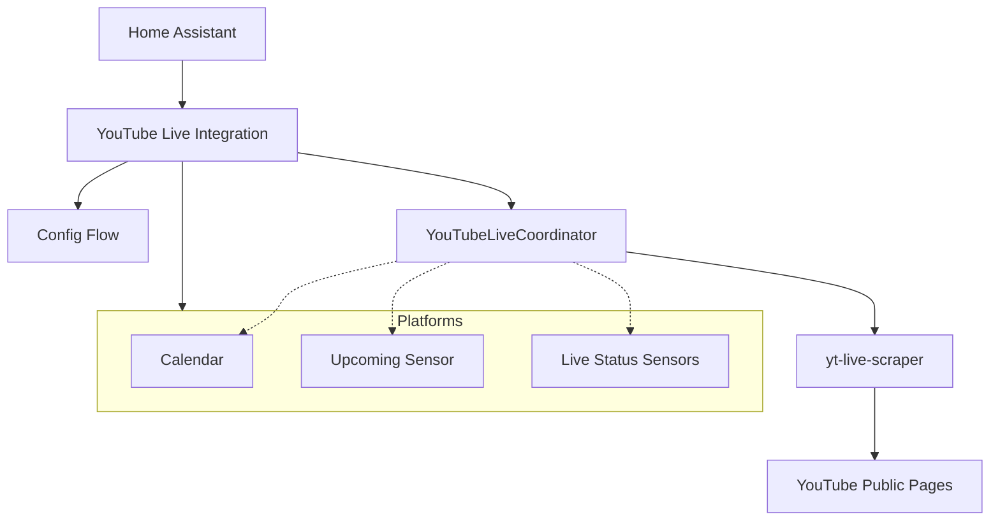

# Architecture of YouTube Live Integration

This document describes the architectural design and data flow of the YouTube Live integration for Home Assistant.

## Overview

The YouTube Live integration allows users to track upcoming and live streams from specified YouTube channels. It groups channels into "Channel Groups," each appearing as a single device in Home Assistant with associated sensors and a calendar.

The integration uses the `yt-live-scraper` library to fetch data from YouTube without requiring an official API key, relying on public channel pages.

## Component Diagram

## Core Components

### 1. Configuration Flow (`config_flow.py`)
Handles the setup of the integration. Users define a **Channel Group** by giving it a name and a list of YouTube channel handles (e.g., `@jonnybergdahl`).
- Validates handles during setup using `yt-live-scraper`.
- Supports Options Flow for adding or removing channels from an existing group.

### 2. Coordinator (`coordinator.py`)
The integration uses a single `YouTubeLiveCoordinator` to manage data fetching and sharing across entities.

#### YouTubeLiveCoordinator
- **Responsibility**: Manages both broad channel scans for upcoming streams and targeted live-status checks for active streams.
- **Data Source**: `yt-live-scraper.scraper.get_upcoming_streams` and `yt-live-scraper.scraper.is_stream_live`.
- **Update Strategy**:
    - **Broad Update**: Every 5 minutes (`DEFAULT_CALENDAR_INTERVAL`), it fetches the full list of upcoming streams for all channels in the group.
    - **Targeted Update**: Every 1 minute (`DEFAULT_SENSOR_INTERVAL`), it checks the live status of streams that are either currently live or scheduled to start soon.
- **Data**: A `YouTubeLiveCoordinatorData` object containing:
    - `streams`: Current list of upcoming streams.
    - `statuses`: Map of video IDs to their live/polling state (`StreamStatus`: `is_live`, `was_live`, `ended`, `ended_at`).
    - `stream_metadata`: Map of video IDs to stream details, preserved even if a stream drops from the main scraper list while live.
- **Working state vs. snapshot**: The coordinator keeps mutable working state across update cycles (`_streams`, `_stream_states`, `_stream_metadata`) and snapshots it into a fresh `YouTubeLiveCoordinatorData` on every update. `self.data` is never mutated in place, so entities always read a consistent snapshot.
- **Single source of truth**: The coordinator exposes the shared derivation helpers `relevant_streams()`, `stream_end_time()`, and `is_stream_active()`. All platforms use these instead of re-implementing "which streams to show", "when a stream ends", and "is a stream still active", so the calendar and sensors stay consistent with each other.

### 3. Platforms

#### Calendar (`calendar.py`)
Displays upcoming streams as events.
- Uses `relevant_streams()` to show both upcoming and currently live streams.
- Events include the channel name, stream title, and a link to the video.
- Event end time defaults to 2 hours after the scheduled start (`DEFAULT_STREAM_DURATION_HOURS`); it is trimmed to the observed end once a stream ends, and kept open while a stream is still live.

#### Sensor (`sensor.py`)
Provides a `YouTubeLiveUpcomingSensor` designed for consumption by external devices like ESPHome.
- **State**: Count of upcoming or currently-live streams (via `is_stream_active()`).
- **Attributes**: A flat list of the next 5 streams (titles, start times, video IDs, channel names, and durations).

#### Binary Sensor (`binary_sensor.py`)
Provides real-time "Live" status indicators.
- **Channel Sensor**: One per channel in the group. `on` when that specific channel is live.
- **Group Sensor**: One per group. `on` if *any* channel in the group is live.
- While live, attributes expose the current stream's title, URL, and video ID; the stream thumbnail is surfaced as the entity picture.

## Data Flow

1. **Broad Discovery**: Periodically polls YouTube for upcoming streams for all configured handles.
2. **Active Monitoring**: Identifies streams in the "active window" and polls their specific status pages frequently.
3. **Unified Observation**: 
    - The **Calendar** updates its view based on all known streams.
    - The **Upcoming Sensor** updates its count and attributes.
    - **Binary Sensors** flip to `on` as soon as a `live` state is detected for a video.

## Design Decisions

- **No API Key**: By using `yt-live-scraper`, the integration avoids the complexity and quota limits of the official YouTube Data API v3.
- **Polling Strategy**: Two-tier polling (Calendar vs. Status) balances the need for timely live-status updates with the overhead of scanning entire channel pages.
- **Channel Groups**: Grouping channels allows for organized dashboards (e.g., "Tech YouTubers" group vs. "Gaming" group).
- **Single Source of Truth**: A single coordinator owns all fetched data and the logic for deriving which streams are relevant, when they end, and whether they are active. Platforms are thin consumers of these shared helpers, which prevents the calendar and sensors from drifting out of sync.
- **Best-effort End Times**: YouTube does not expose a reliable end timestamp for a stream, so the coordinator records the moment a live stream is first observed to have stopped and uses that as the event end. Streams that never went live fall back to the default 2-hour duration.
